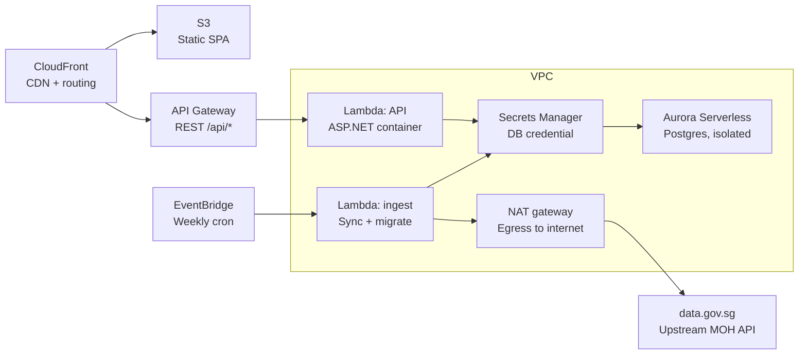

# AWS Setup

This document describes the AWS architecture for the MohCovidInsights application.

## Architecture Overview

- **CloudFront** serves the static SPA from **S3** and routes API traffic to **API Gateway** under `/api/*`.
- **API Gateway** forwards REST requests to the API Lambda container.
- The **API Lambda** runs the ASP.NET application inside a Lambda container and is deployed within the VPC.

## Scheduled Ingestion

- **EventBridge** triggers the ingest Lambda on a weekly schedule.
- The **ingest Lambda** performs sync and migration tasks.

## Data and Secrets

- **Secrets Manager** stores database credentials for the Aurora Serverless Postgres cluster.
- The ingest Lambda and API Lambda use Secrets Manager to access the database securely.

## Network and External Access

- The VPC contains the Lambdas and the Aurora Serverless database.
- A **NAT Gateway** provides egress access to the internet for the ingest Lambda.
- The ingest Lambda retrieves upstream data from **data.gov.sg**.

## Components

- S3: static SPA hosting
- CloudFront: CDN and routing
- API Gateway: REST API entry point
- Lambda (API): ASP.NET container runtime
- Lambda (ingest): sync and migrate jobs
- EventBridge: scheduled weekly cron
- Secrets Manager: DB credentials
- Aurora Serverless: isolated Postgres backend
- NAT Gateway: outbound internet egress
- data.gov.sg: upstream MOH API
